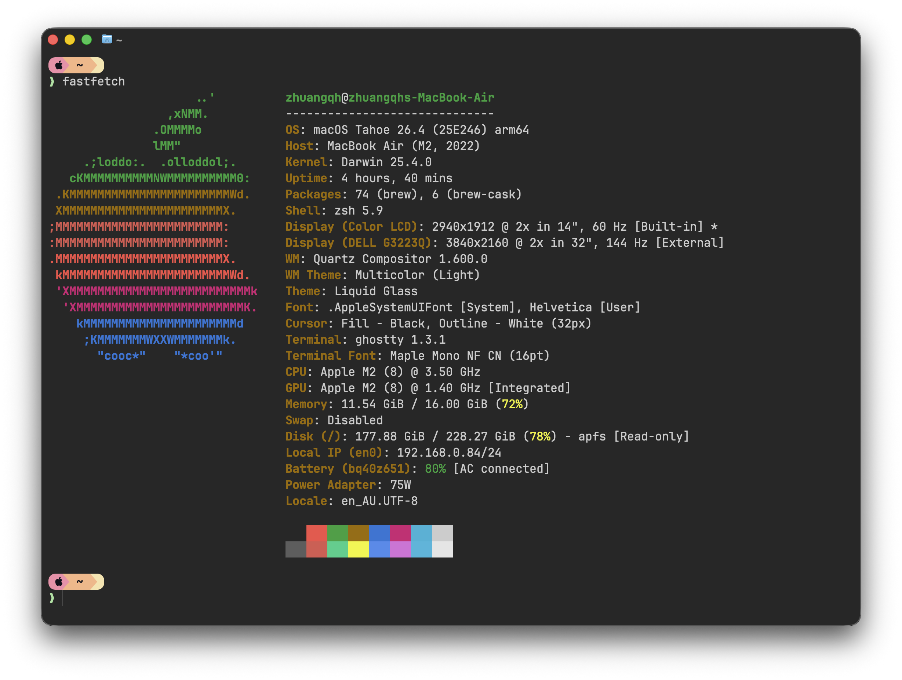

# dotfiles

Personal macOS dotfiles for the terminal and editor stack in this repo.



## Included

- `.zshrc`: Zsh shell setup with Oh My Zsh, Starship prompt, and a `yy` wrapper for Yazi.
- `.config/starship.toml`: Starship prompt theme.
- `.config/ghostty/config`: Ghostty terminal configuration.
- `.spacemacs`: Spacemacs configuration.

## macOS dependencies

This setup expects the following tools on macOS:

- Oh My Zsh
- Starship
- Yazi
- Ghostty

Install them with the bootstrap script:

```bash
./scripts/install-macos.sh
```

The script will:

- install Homebrew if it is missing
- install `starship` and `yazi` with Homebrew
- install `ghostty` with Homebrew Cask
- install Oh My Zsh in unattended mode if it is not already present

## Apply the dotfiles

After installing dependencies, link the files into your home directory:

```bash
ln -sf "$PWD/.zshrc" "$HOME/.zshrc"
ln -sf "$PWD/.spacemacs" "$HOME/.spacemacs"
mkdir -p "$HOME/.config"
ln -sfn "$PWD/.config/starship.toml" "$HOME/.config/starship.toml"
mkdir -p "$HOME/.config/ghostty"
ln -sfn "$PWD/.config/ghostty/config" "$HOME/.config/ghostty/config"
```

Then reload your shell:

```bash
exec zsh
```

## Notes

- The Ghostty and Starship configs use Nerd Font glyphs. Install a compatible Nerd Font if icons do not render correctly.
- The Ghostty config is macOS-oriented and uses macOS-specific window settings and keybindings.
